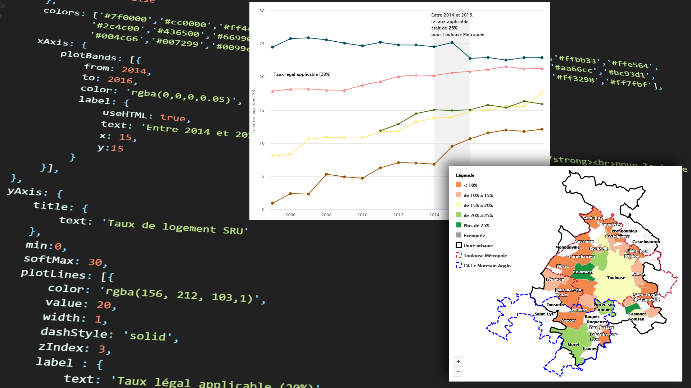
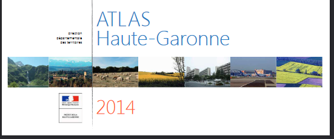
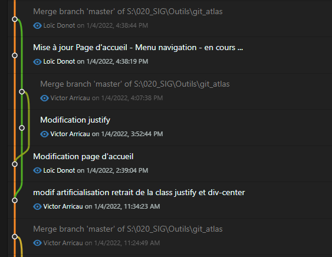
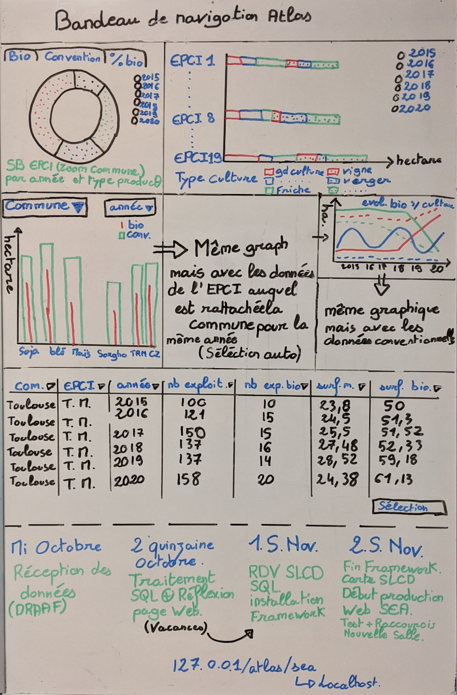
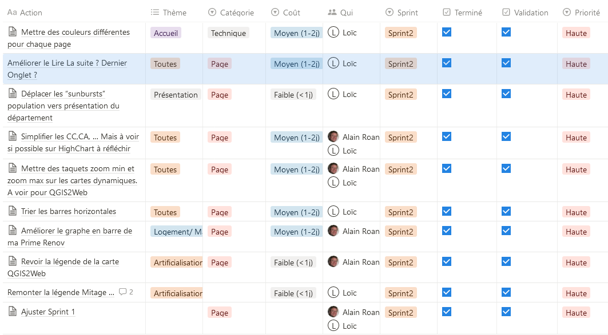
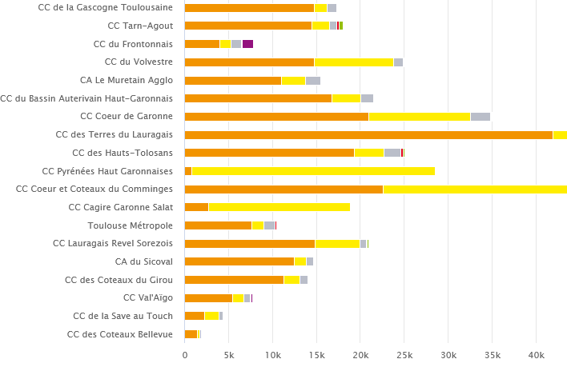

---
presentation:
  width: 960
  height: 700
  minScale: 1
  maxScale: 2
  # presentation theme
  # === available themes ===
  # "beige.css"
  # "black.css"
  # "blood.css"
  # "league.css"
  # "moon.css"
  # "night.css"
  # "serif.css"
  # "simple.css"
  # "sky.css"
  # "solarized.css"
  # "white.css"
  # "none.css"
  theme: simple.css

---

<!-- slide  -->

#### Atlas numérique de la DDT 31

<!-- slide -->
#### Objectif

##### **Alternative au format papier**

Le support numérique propose d'indéniables avantages par rapport au papier.

Il permet notamment de **sortir du carcan** des cartes statiques **figées** à l'échelle d'un département et des limites imposées par les formats de page.

L'objectif de ce projet a été de mettre à profit ces avantages pour donner à voir les données de manière plus **dynamique** et pertinente sous une forme **innovante**.

<!-- slide data-background-image="imgs/photo_page_sea.jpg"data-background-size="40% 100%" data-background-position="0 0" -->
#### &nbsp;&nbsp;Méthode

- Thématique
  - réunions avec le service concerné
    - Quelles données sont les plus pertinentes
    - Comment les obtenir
    - Comment les représenter
    

<!-- slide  -->

  

    <h4>Aspect technique</h4>
    
L'atlas numérique de la DDT 31 est un site internet utilisant des outils libres et/ou gratuits. Il est
        développé en interne avec des **participations externes**.

  - Structure et le fonctionnement: **php** & **framework codeigniter**
  - Style & "responsive": **bootstrap 5**
  - Cartographies dynamiques: **openlayers 6**

  - Graphiques dynamiques et cartes statistiques: **HighCharts.js** 
  - Aussi utilisées pour certains graphiques et cartes: **D3.js** et **plot.js**
  - Gestionnaire de version: **Git**
    

  

  

    
  

<!-- slide  -->
<table>
<tr>
<td valign="middle">

</td>
<td valign="middle">></td>
<td style="Width:50%">
  
</td>
</tr>
</table>

<!-- slide  -->

#### Coopérations

- Début du projet, prototype et premiers développements avec Victor Arricau.

- Travail avec Alain Roan (perceptible.fr). Améliorations et optimisations.

<!-- slide  -->

##### Extrait du travail réalisé avec `perceptible.fr`

<!-- slide  -->
<h4>Progression</h4>
<table>
<tr>
  <td valign="middle">
  
  </td>
  <td valign="middle">></td>
  <td style="Width:50%">
    
  </td>
</tr>
<tr>
  <td valign="middle">
  
  </td>
  <td valign="middle">></td>
  <td style="Width:50%">
    
  </td>
</tr>

</table>

<!-- slide data-background-image="imgs/responsive_accueil.png"  -->

Le site est "responsive"

<!-- slide   -->

#### Préparation des données ... Outils
- QGIS 
- Postgre / postgis
- batch, ogr
- Duckdb 

---

#### Outil spécifique: 

- GéoIDE carto (cartes en ligne, flux wms)

<!-- slide -->

